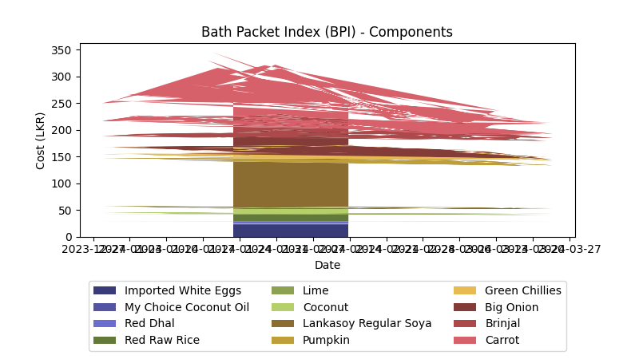

# Food for Sri Lanka (lk_food)

**Food for Sri Lanka** is a broader effort with the goal of making sure that *All Sri Lankans eat a balanced diet of real food*.

This repository contains various tools to help with this effort.

## Progress

* [X] Scrape information about food (*2023-12-21*)
* [ ] Download food images
* [ ] Add ingredients information
* [ ] Add nutrient information
* [ ] Add Novo Classification
* [ ] Automatically derive badges according to various characteristics
* [ ] Add links to online and offline sources that sell this food

## Food Data

> [!IMPORTANT]
> Scraped 3,795 items as of 2026-03-16 05:38:49.

## 50g of Protein

Item | Quantity | Cost (LKR)
:--- | ---: | ---:
🍲 Red Dhal | **200.0** g | **49.80** LKR
🍚 Red Raw Rice | **562.0** g | **113.52** LKR
🍲 Lankasoy Regular Soya | **90.0** g | **120.00** LKR
🐟 Tuna Slices | **178.6** g | **298.21** LKR
🥜 Raw Peanuts | **192.3** g | **350.00** LKR
🍗 CIC Skinless Boneless Chicken Breast | **161.3** g | **412.10** LKR
🥛 Ambewela Fresh Milk | **1.4** l | **742.86** LKR

## Bath Packet Index (BPI)

Item | Quantity | Cost (LKR)
:--- | ---: | ---:
🍋 Lime | **4.0** g | **0.66** LKR
🌶️ Green Chillies | **8.0** g | **3.24** LKR
🍲 Red Dhal | **16.0** g | **3.98** LKR
🎃 Pumpkin | **40.0** g | **5.40** LKR
🧅 Big Onion | **40.0** g | **13.96** LKR
🍚 Red Raw Rice | **73.0** g | **14.75** LKR
🥥 Coconut | **0.1**  | **14.96** LKR
🍆 Brinjal | **40.0** g | **16.00** LKR
🥕 Carrot | **40.0** g | **19.48** LKR
🍲 Lankasoy Regular Soya | **54.0** g | **72.00** LKR
**TOTAL** |   | **164.44** LKR

### Daily Trend

> [!IMPORTANT]
> For details on methodology, see [Bath (බත්) Packet 2.0](https://medium.com/on-economics/bath-%E0%B6%B6%E0%B6%AD%E0%B7%8A-packet-2-0-f3e999c54bf5).

## References

### Novo Classification 🇧🇷

The Nova classification (Portuguese: nova classificação, 'new classification') is a framework for grouping edible substances based on the extent and purpose of food processing applied to them. Researchers at the University of São Paulo, Brazil 🇧🇷, proposed the system in 2009.

Nova classifies food into four groups:

1. Unprocessed or minimally processed foods
2. Processed culinary ingredients
3. Processed foods
4. Ultra-processed foods

[Learn more...](https://en.wikipedia.org/wiki/Nova_classification)
